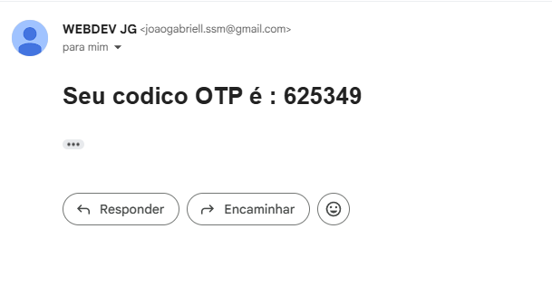

# Autenticação - MERN STACK

## Descrição

O **Authentication MERN Stack** é um projeto focado na implementação de uma autenticação manual sem dependência de ferramentas externas. Os usuários podem:

- Registrar-se
- Logar
- Verificar a conta
- Redefinir a senha através de um código OTP enviado por e-mail

Tudo isso garantindo um sistema de segurança eficiente e completo!

---

## Funcionalidades

- **Registro de usuário** com senha criptografada
- **Login seguro**
- **Verificação de conta** via OTP enviado por e-mail
- **Recuperação de senha** via OTP e redefinição de credenciais
- **Autenticação JWT**

---

## Tecnologias Utilizadas

### Frontend

- **React + Vite**
- **JavaScript**
- **Dotenv** (para variáveis de ambiente)
- **Axios** (para requisições HTTP)
- **CSS puro**

### Backend

- **Node.js + Express.js**
- **MongoDB + Mongoose**
- **Bcryptjs** (para criptografar senhas)
- **Cookie-Parser** (para manipulação de cookies)
- **Cors** (para permitir comunicação entre diferentes origens)
- **Dotenv** (para variáveis de ambiente)
- **Jsonwebtoken (JWT)** (para autenticação)
- **Nodemailer** (para envio de código OTP via e-mail)

---

## Estrutura do Projeto


AUTHENTICATION MERN STACK
├── frontend/   # Interface do usuário (React + Vite)
├── backend/    # Servidor e banco de dados (Node.js + Express + MongoDB)
└── README.md   # Documentação

---

## Configuração e Instalação

### 1. Clonar o repositório

```bash
git clone https://github.com/seuusuario/Authentication-MERN-Stack.git
cd Authentication-MERN-Stack
```


### 2. Configurar o Backend
```
cd backend
npm install
```

### Crie um arquivo .env no diretório backend com as seguintes variáveis:
```env
NODE_ENV="development"
DB_PASS=sua senha do mongoDB
DB='mongodb+srv://<username>:<password>@<cluster-url>/<database>?retryWrites=true&w=majority' obs: substitua pelas as suas informações, geralmente no painel do mongoDB
PORT= a porta do servidor, como por exemplo "PORT=8000"

JWT_SECRET=String secreta pro JWT
JWT_EXPIRES_IN = data de expiração do JWT por exemplo "90d"
JWT_COOKIE_EXPIRES_IN = data de expiração do cookie, como  por exemplo "90"

EMAIL_PASS=sua senha do email, dependendo de qual serviço irá ultilizar
EMAIL_USER=seu email de usuario
```

### Inicie o backend:

### npm start

### 3. Configurar o Frontend
```
cd /frontend
npm install
```

### Crie um arquivo .env no diretório frontend:
```
VITE_BACKEND_URL=endereço da URL do backend, como por exemplo a ultilizada no projeto: 'http://localhost:8000/api/v1'
```

### Inicie o frontend:
```
npm run dev
```

### Para Contribuição

Fork o repositório.
```
Crie uma branch (git checkout -b feature/nova-feature).
```
```
Commit suas alterações (git commit -m 'Adiciona nova feature').
```
```
Push para o repositório (git push origin feature/nova-feature).
```

### Abra um Pull Request.
---

#### screenshots do Projeto:

### **Página Principal**

---
### **Página de Registro**

---

### **Página de Login**

---

### **Página de Verificação**

---

### **Página pra verificar o email**

---

### **Códico no email**

---

### **Página de Registro**

---

### **Página Logado e verificado**

---

### **Dados salvos no banco de dados**

---


Licença

#### Este projeto está sob a Licença MIT.

### Contato

#### Nome: Gabriel

#### Email: joaogabriell.ssm@gmail.com


